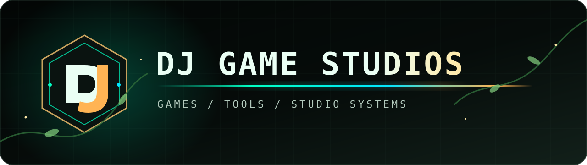

An independent game studio led by [DJ MSQRVVE](https://youtube.com/@djmsqrvve).

[Website](https://djmsqrvve.com) · [YouTube](https://youtube.com/@djmsqrvve) · [Twitch](https://twitch.tv/djmsqrvve)

## Helix MMORPG

**Helix MMORPG is our flagship and primary development focus:** a 3D, fantasy-first persistent world centered on evolution, identity, spirit, and transformation.

The current mainline uses a custom Rust `wgpu`/`winit` client, a QUIC game server, shared game and data foundations, and an in-house world and asset pipeline. It is under active private development.

## The wider Helix slate

- **Helix 2000** — an active 2D browser MMORPG and a different expression of the same world.
- **Helix Card Online** — an active online card-game branch.
- **DJ-Engine** — an independent Rust engine supporting adjacent Helix games and experiments.
- **Helix tools and data** — the private foundations behind characters, world data, assets, validation, and production workflows.

Helix is the main universe. Genre experiments and alternate interpretations do not replace the flagship direction.

## Public releases and tools

Core game source remains private by default. What we publish here falls into two deliberate categories: end-user releases and reusable studio infrastructure.

| Public project | Role | Current posture |
| --- | --- | --- |
| [DJ-Engine Releases](https://github.com/DJ-Game-Studios/dj-engine-releases) | Community-test game and engine builds | Early release channel |
| [Helix Blender Tools](https://github.com/DJ-Game-Studios/helix-blender-addon) | `.helix` package workflow for Blender | Maintained installable addon |
| [Helix 3D Viewer](https://github.com/DJ-Game-Studios/helix-viewer-releases) | Viewer-era binaries, samples, and format documentation | Legacy maintenance channel |
| [DJ Mouse Warp](https://github.com/DJ-Game-Studios/dj-mouse-warp) | Natural cursor travel across mismatched GNOME monitor rows | Studio infrastructure |
| [DJ GNOME Focus](https://github.com/DJ-Game-Studios/dj-gnome-focus) | Window activation and tiling on GNOME Wayland | Studio infrastructure |

These repositories are authentic parts of DJ Game Studios, but they are not a complete portfolio map or an indication that every public utility is a flagship product.

## Follow development

Development videos, demos, and behind-the-scenes work are published on [YouTube](https://youtube.com/@djmsqrvve) and [Twitch](https://twitch.tv/djmsqrvve). Studio updates and future public releases are collected at [djmsqrvve.com](https://djmsqrvve.com).

---

Games, tools, and the systems that make both possible.

